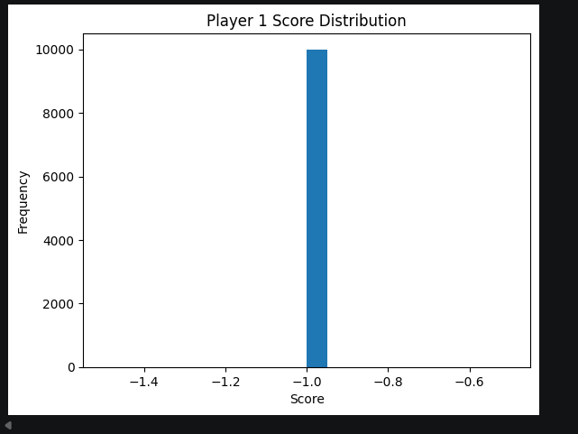
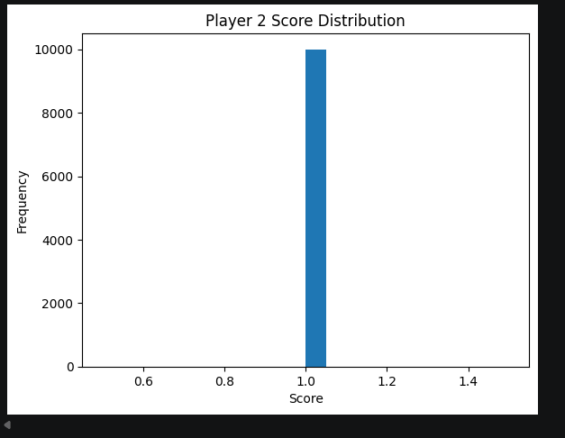
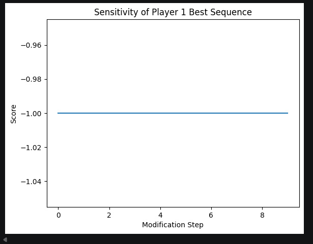
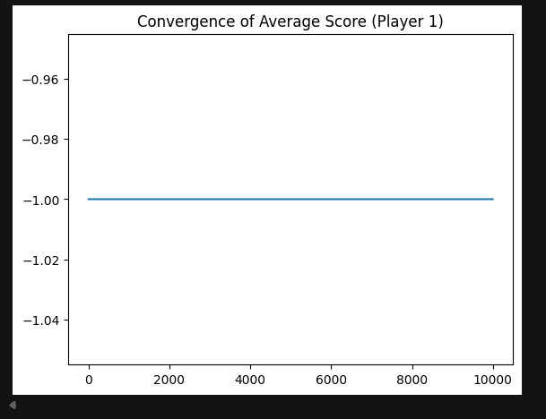
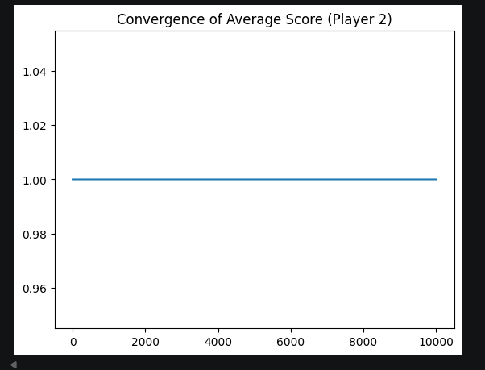

# Code Challenge 2 - Rock, Paper, Scissors Game

This code challenge demonstrates a rendition of the classic **Rock, Paper, Scissors** game.
The game is contested by two players `(Player 1, Player 2)` over N rounds.

During each round, both players throw either **Rock (R)**, **Paper (P)** or **Scissors (S)** at the same time.

## Game Rules

The following rules apply:

    - Rock beats Scissors (R > S)
    - Scissors beat Paper (S > P)
    - Paper beats Rock (P > R)

## Game Logic

If Player 1's throw beats Player 2's throw, Player 1 gains one point. Therefore, Player 2 loses one point.

    score1 = +1
    score2 = −1

If Player 2's throw beats Player 1's throw, Player 2 gains one point. Player 1 loses one point.

    score1 = -1
    score2 = +1

A draw, results in zero (0) points for both players.

    score1 = 0
    score2 = 0

Then, Players 1 and 2 will contest over a pre-defined number of rounds N under the restriction that each player
has to use a given mixture of the three possible strategies given by:

    W1 = (R1, P1, S1)

for Player 1, and:

    W2 = (R2, P2, S2)

for Player 2, such, that:

    R1 + P1 + S1 = N
    R2 + P2 + S2 = N

## Packages

- Statistics
- Counter (imported from built-in Collection module)
- Matplotlib
- Pandas

## Results
### Average Score

On a pre-defined number of two (2) rounds, the average score defined for each player is:

    Player 1 average:  -1.0
    Player 2 average:  1.0

### Best Sequence of Moves

On a pre-defined number of two (2) rounds, the best sequence of moves for each player are:

    Best P1 sequence: ['R', 'P']

for Player 1, and:

    Best P2 sequence: ['P', 'P']

for Player 2.

In this example, the sequence of moves that appears the most is 'P' (Paper) on both players, according to simulations.

- On Player 1, the number of Paper ('P') frequencies is 5045.
- On Player 2, the number of Paper ('P') frequencies is 10000.

### Score Distributions

On a pre-defined number of two (2) rounds, the distribution of scores for each player across all simulations is:

    Player 1 score distribution:  Counter({-1: 10000})

for Player 1, and:

    Player 2 score distribution:  Counter({1: 10000})

for Player 2.

### Standard Deviation

In this example, the standard deviation of each player's score is:

    Player 1 standard deviation:  0.0

for Player 1, and:

    Player 2 standard deviation:  0.0

for Player 2.

It indicates that there is no variation in the data being measured in the current example.

### Best Scores

On a pre-defined number of two (2) rounds, the best score for each player is:
    
    Best P1 score: -1

for Player 1, and:

    Best P2 score: 1

for Player 2.

### Dataframe for Players and Best Scores

On a pre-defined number of two (2) rounds, a dataframe was created to display best scores, sequences and frequencies.
Therefore, a table displaying the above data was additionally created.

        Player  Best Score Best Sequence  Frequency
    0  Player 1          -1        [R, P]       5045
    1  Player 2           1        [P, P]      10000

## Visual Distributions

### Score Distribution

For Player 1, the score distribution is:

For Player 2, the score distribution is:

### Sensitivity Analysis on Best Sequence

Sensitivity analysis is:

### Convergence of Average Score

For Player 1, convergence of average score is:

For Player 2, convergence of average score is:

## Example

On a defined number of ten (10) rounds, the average score defined for each player is:

    Player 1 average:  0.0988
    Player 2 average:  -0.0988

The standard deviation for each player is:

    Player 1 standard deviation:  2.602636342555978
    Player 2 standard deviation:  2.602636342555978

The distribution of scores for each player across all simulations is:

    Counter({1: 4247, -2: 3311, 4: 1582, -5: 725, 7: 116, -8: 19})

for Player 1, and:

    Counter({-1: 4247, 2: 3311, -4: 1582, 5: 725, -7: 116, 8: 19})

for Player 2.

The best sequence for each player, across all simulations is:

    ['P', 'R', 'S', 'S', 'P', 'R', 'P', 'P', 'S', 'P']

for Player 1, and:

    ['P', 'R', 'S', 'R', 'S', 'P', 'R', 'S', 'P', 'P']

for Player 2.

The best score for each player is:
    
    Best P1 score: 7

for Player 1, and:

    Best P2 score: 8

for Player 2.

Therefore, a table displaying best scores, sequences and frequencies was additionally created.

     Player  Best Score                   Best Sequence  Frequency
0  Player 1           7  [S, R, S, R, P, P, P, S, P, P]          5
1  Player 2           8  [S, S, P, P, P, R, R, P, R, S]          4

### Visual Representation

